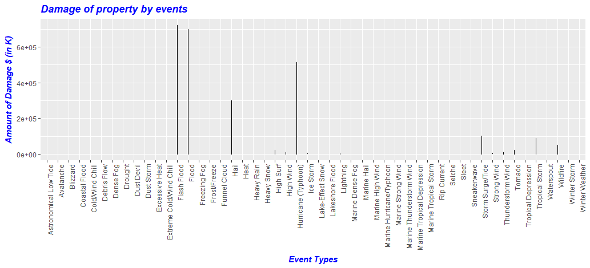
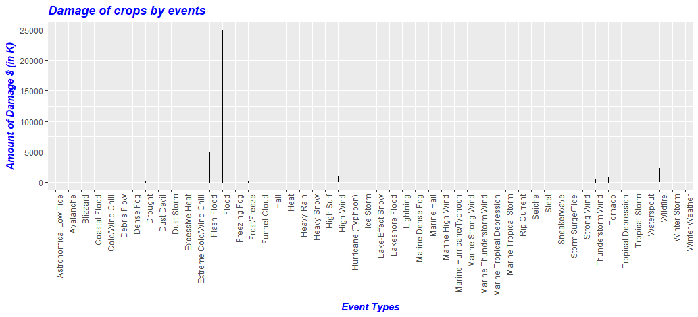
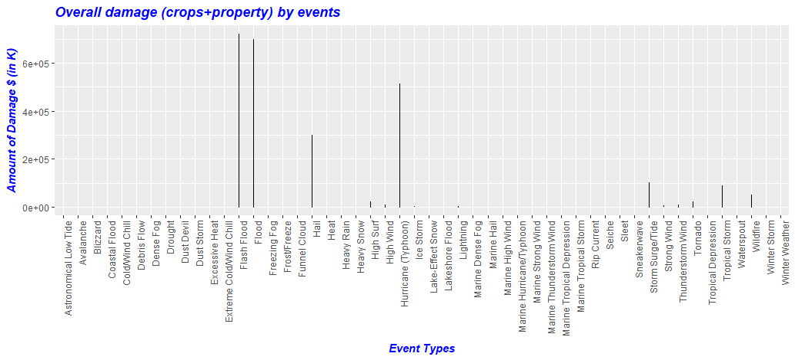
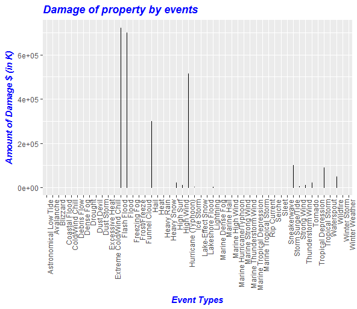
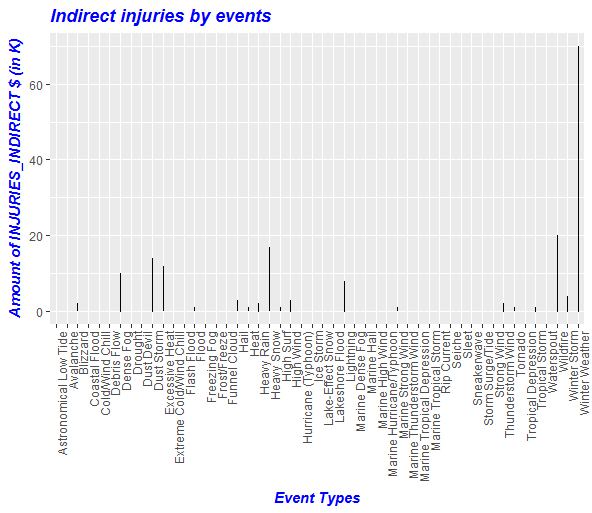
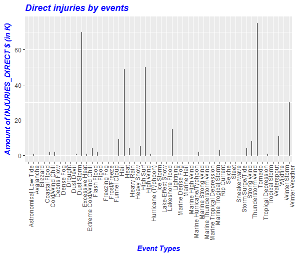
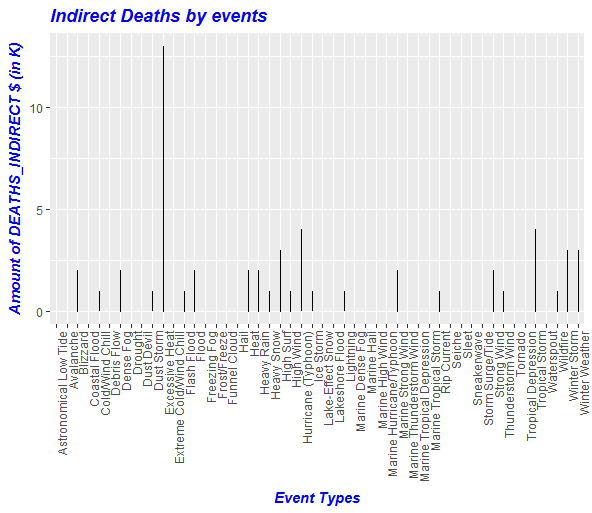
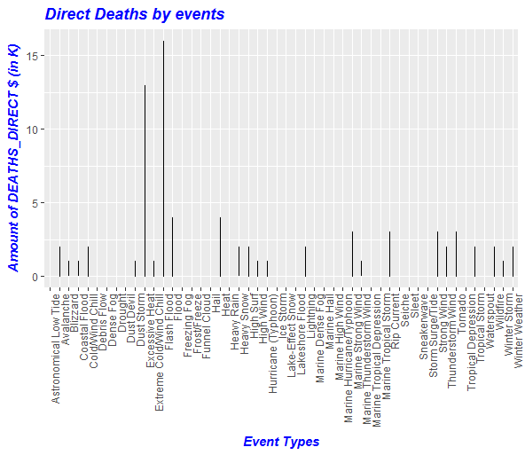

## Q4. RCodes and Plots for Estimated amount of damage(damage property & damage crops) caused by each event

Rcodes for genrating the plot along with data preparation is placed as [Q4_Rcode](Q4_Plot.R)

Following are the plots

### Plot 1

 

### Plot 2

 

### Plot 3

 

## Q5. RCodes and Plots for Estimated amount of Fatalites & Damage caused by each event

Rcodes for genrating the plot along with data preparation is placed as [Q5_Rcode](Q5_Plot.R)

Following are the plots

### Plot 1

 

### Plot 2

 

### Plot 3

 

### Plot 4

 

### Plot 5

 
